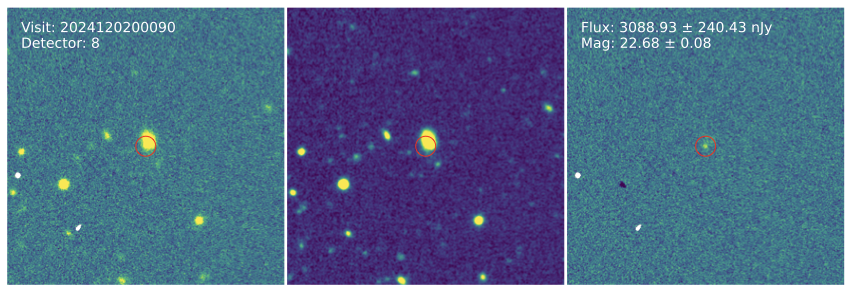

# SLIDE: Subtracting LSST Images with DECam Exposures

SLIDE performs image subtraction on LSST data using DECam templates. It is designed to run directly on the Rubin Science Platform (RSP). SLIDE can automatically retrieve templates from DES DR2 or DECaLS DR9. Users may also supply custom DECam templates. An example of image subtraction made by SLIDE is shown below.



We thank Griffin Hosseinzadeh for providing the PyZOGY image subtraction example: https://github.com/griffin-h/image_subtraction

## Citation

If you use this package in your research, please cite:

```
Dong et al. (in prep)
```

## Installation

### Prerequisites

Most dependencies of this package has been installed on RSP. If you miss any packages, you can install them as following:

```bash
pip install --user reproject
```

### PyZOGY

This package depends on PyZOGY for image subtraction (https://github.com/dguevel/PyZOGY/tree/master):

```bash
# Install PyZOGY on RSP
git clone https://github.com/dguevel/PyZOGY.git
cd PyZOGY
pip install --user -e .
```

### Install SLIDE (you will need to install SLIDE on RSP)

#### Option 1: Install from GitHub

```bash
git clone https://github.com/yizedong/SLIDE.git
cd SLIDE
pip install --user -e .
```

#### Option 2: Install from PyPI

```bash
pip install --user slide-lsst
```

## Documentation

For detailed usage examples, see the [`example.ipynb`](https://github.com/yizedong/SLIDE/blob/main/example.ipynb) notebook included in the package.

## Contributing

Contributions are welcome! Please feel free to submit a Pull Request.

## License

This project is licensed under the MIT License - see the LICENSE file for details.
